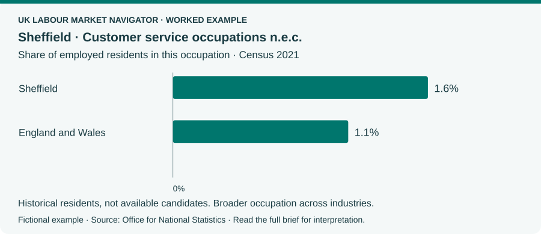

<p align="center">
  
</p>

<p align="center"><strong>Evidence-led labour market research companion for People and Talent practitioners.</strong></p>

<p align="center">
  <a href="https://loubuilds.github.io/uk-labour-market-navigator/"><strong>View the example</strong></a> ·
  <a href="#get-your-first-brief"><strong>Get started</strong></a> ·
  <a href="#what-the-evidence-covers"><strong>Coverage</strong></a> ·
  <a href="docs/architecture.md"><strong>How it works</strong></a>
</p>

---

**“What evidence would strengthen our business case for higher pay?”**

Bring a work question to your coding agent and get a readable brief: checked workforce, advertising, earnings and wider-market figures, an explanation for your decision, and practical questions to investigate next.

The fictional example follows a financial-services team hiring customer service advisers on-site in Sheffield. Following stakeholder discussions in the scenario, it explores the evidence and recruitment actions that would strengthen a case for higher pay, without inventing employer findings.

[](https://loubuilds.github.io/uk-labour-market-navigator/)

**[View the designed example →](https://loubuilds.github.io/uk-labour-market-navigator/)** · **[Read it on GitHub](examples/brief.md)** · [Download HTML](examples/brief.html)

*Preview: the actual chart from the generated report. The full brief explains what it contributes and what remains unresolved. The designed example opens directly in your browser, with expandable source explanations.*

**Fictional worked example using public official statistics.**

Financial services is organisational context only. The broader customer-service occupation spans industries; it does not isolate relevant industry experience, product knowledge or regulatory competence. [Example scope and interpretation](docs/worked-example.md).

## Who it suits

People and Talent practitioners who want evidence for a hiring discussion; people analytics and talent intelligence specialists who want inspectable sources; and developers exploring a research workflow they can adapt.

You need **Python 3.11 or later** and a coding agent such as **Codex or Claude Code**, with its own access arrangements. The official engine needs **no data-provider API key and no additional Python dependencies** when used from this checkout.

**Python checks the evidence. AI helps you explore it. You bring the professional context and judgement.** A report is a starting point: a little discussion about the role, offer and candidate experience can make its next steps much more useful. The engine itself makes no AI model call. Figures are checked against bundled official sources; interpretation still needs professional review.

## Get your first brief

1. Download or clone [this repository](https://github.com/loubuilds/uk-labour-market-navigator) into a folder of your choice.
2. Open that folder as a project in Codex or Claude Code.
3. Say **“Set this project up and walk me through the fictional Sheffield customer-service example.”** Or say **"Help with a hire"** and give a role and town. You do not need to work out the research question first.

**Not sure whether Python is ready?** That is part of setup. Your agent will check first and, if needed, help you install a suitable version before returning to your question. You do not need to learn Python. [Help with Python setup](docs/python-setup.md).

The agent handles local setup and the research commands. There is no profile questionnaire, JSON to write or statistical code to choose. It proposes a short scope in ordinary language and asks about material choices, including whether a separate UK earnings benchmark is useful.

Once the evidence is checked, you can [talk through what it means for your role and offer](docs/discussing-your-brief.md), or go straight to the brief. A short discussion helps tailor the next steps to your recruitment situation. You receive a link to your **HTML brief**, with a Markdown copy alongside it. Ask **“What can you do?”** for guidance or **“Show me the source for that figure”** to look more closely. Use general professional context and keep confidential employer/client material, personal data and credentials out of research; your agent may retain its conversation and tool history.

<details>
<summary>Prefer terminal setup?</summary>

Run from the repository folder after identifying Python 3.11 or later. `python3` or `py -3` may select an older version: check its version first and use the compatible interpreter. Check any existing environment before creating another. See [Python setup](docs/python-setup.md).

Windows PowerShell:

```powershell
py -3 -m venv .venv
.venv/Scripts/python.exe -m uk_labour_market_navigator setup
```

macOS/Linux:

```sh
python3 -m venv .venv
.venv/bin/python -m uk_labour_market_navigator setup
```

No dependency installation is needed for source-checkout use. To install the named command, use the environment interpreter with `-m pip install .`, then `uk-labour-market-navigator help`. The [validation notes](docs/validation.md) distinguish platforms exercised from those still needing testing.

</details>

## What the evidence covers

Explore a whole occupation in a named district, or compare up to **three explicitly chosen districts**. The views answer different questions:

| View | What it contributes | Scope and date |
| --- | --- | --- |
| Resident workforce | Historical scale and share of employment; not available candidates | England and Wales Census districts, Census 2021 |
| Employer advertising | Recruitment advertising activity; not distinct vacancies or proof of shortage | Published UK districts, April–June 2026; June partly estimated, London boroughs unavailable and many cells suppressed |
| Wider local conditions | Claimant proportion and annual change, employment, inactivity and model-based unemployment; context, not a tight/loose score | Nomis April 2023 districts and same-period UK benchmarks; July 2026 claimants and April 2025–March 2026 survey/model window |
| Prices and earnings growth | Inflation and average earnings trends for a pay discussion; not an updated role salary | UK CPI/CPIH to July 2026; GB regular/total earnings growth, April–June 2026 versus a year earlier |
| Official earnings | A starting benchmark; not a local competitive offer or pay diagnosis | Separately accepted UK-wide whole-occupation earnings, ASHE 2025 provisional corrected edition |

Earnings can be annual gross or hourly excluding overtime, with all, full-time and part-time patterns kept separate. Separate UK paid-hours benchmarks help put the working week in context; they are not the hours associated with median annual earnings. Each source retains its own population, boundary and period. Missing sections stay visible while independent checked findings can still be useful. Scotland and Northern Ireland have no workforce evidence in this pack. [Full coverage](docs/coverage.md) · [Understanding wider conditions](docs/local-context.md).

A question about Senior Java Developers can use broader software-development evidence if you agree, while keeping Java and seniority unanswered. There are no measured specialist, available-candidate or commuting subsets, no hiring score and no automatic source refresh. Reports retain their displayed source periods. [How the evidence is checked](docs/methodology.md).

## Explore the project

- [Architecture](docs/architecture.md): conversation, accepted scope, evidence, interpretation and saved-report verification.
- [Validation](docs/validation.md): reproduce the example, check sources and exercise a fresh offline installation.
- [Static example hosting](docs/example-hosting.md): the live demonstration and its manual GitHub Pages workflow; it is not a hosted engine.
- [Optional Adzuna](docs/adzuna.md): experimental, separately permissioned user-owned access, outside official saved-report evidence. The core does not need it; ongoing provider access is not promised free.

V0.1 does not include profiles, maps, arbitrary time-series queries, arbitrary web research or extra document formats. This is independent software, not an official government service.

## Licence and contributions

Copyright 2026 Louise Mead. Software is **[GNU AGPL v3.0 only](LICENSE)**. [Licence notes](docs/licensing.md), [official-data attribution](THIRD_PARTY_NOTICES.md) and [documentation terms](LICENSE-DOCS.md) describe their separate conditions. [Contributions](CONTRIBUTING.md) are welcome within those terms.

Tool designed and built by Louise Mead. [Explore Louise's work on GitHub](https://github.com/loubuilds).
