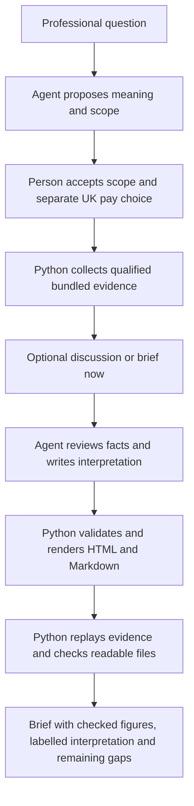

# How a question becomes a checked brief

The coding agent handles conversation and interpretation. The Python package handles evidence, calculations and saved-report verification. The package itself does not call an AI model.

| Stage | Responsibility and record |
| --- | --- |
| Question and scope | `start` preserves the original question, requested role, selected districts and unsupported requirements in `plan.json`. The agent explains any broader occupation, geography or UK pay choice before `collect` records the user's agreement. Code cannot certify that a conversation obtained genuine consent. |
| Evidence collection | `market.py` coordinates Census workforce, `demand.py` advertising and `pay.py` earnings against pinned public source snapshots. Calculations and source-cell provenance enter `evidence.json`. Failed families contribute no facts; independent supported families can continue. |
| Interpretation | The agent uses `synthesis-context.json` to prepare and review `synthesis.json`. Sections reference fact IDs. Structural validation rejects unsupported numerical prose; it does not prove qualitative claims or diagnose recruitment difficulty. |
| Rendering | `report.py` turns checked evidence and reviewed prose into HTML and Markdown. Interpretation comes before detailed tables; numerical displays, source dates, populations and limitations come from the evidence. `publish` is the local file-generation command. |
| Verification | `workflow.verify` replays the accepted evidence against installed snapshots, validates the draft and manifest, checks hashes and regenerates readable files for comparison. Failure withholds the report's findings and leaves files intact. Reopening does not fetch newer observations. |

## Why there are older report renderers

**Current reports use format 15 in `report.py`.** A saved run's `manifest.json` records the rendering format used when it was created. `_report_v1.py` through `_report_v14.py` preserve earlier output contracts. Format three also supplies shared helpers and handles the older evidence schema through the current renderer's explicit fallback.

Verification selects the recorded renderer. A wording or layout improvement must not make a previously intact report appear tampered with, or silently rewrite it. Before changing generated output, preserve the previous renderer, advance the manifest format, add the dispatch in `workflow.py` and test that the old report reopens without any bytes changing. Shared historical helpers must remain stable too. This is bounded compatibility, not a second research engine.

Reports carry hashes and replayable source records; these are integrity checks against the installed trusted package, not a cryptographic guarantee against someone replacing the whole installation. AI interpretation remains explicitly outside numerical verification.

## Public example and optional provider

`scripts.make_example` runs the same collection, publication and verification workflow in a temporary directory using the explicitly accepted fictional request. It also extracts the actual chart into the README preview. `--check` compares all generated outputs without replacing them. Static hosting copies only the checked HTML; it runs no research service.

Experimental Adzuna research is separate from this path. It requires the person's own permitted account use and explicit search authorisation; provider adverts do not enter official saved reports. See [provider boundaries](adzuna.md), [source methodology](methodology.md) and [release validation](validation.md).

New paid-hours plans use evidence schema five; prior context-enabled plans retain schema four. The hours selection accompanies the separately accepted UK occupation/pay-pattern choice. Declining that choice omits hours too. Older schema-three plans retain their original families. The local and national context components fail independently; a missing local indicator withholds its selected-area comparison while other verified indicators continue. Both components participate in normal fact references, source replay and surface regeneration.
